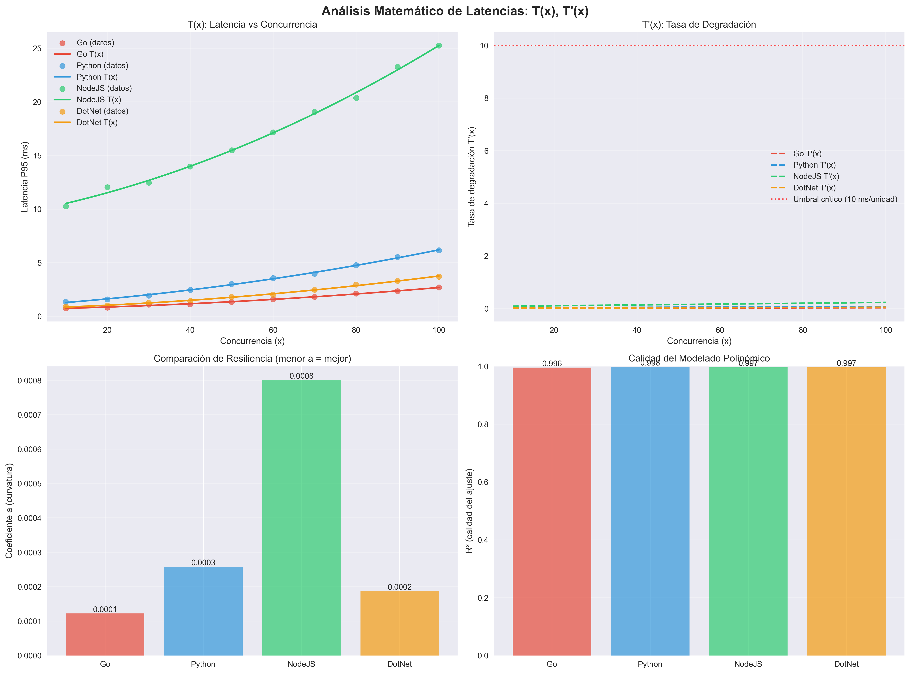

# Análisis Matemático de Latencias: T(x), T'(x), T''(x)

**Fecha:** 2025-06-29 19:14:29
**Datos fuente:** mathematical-benchmark-20250629-191338.csv

## 1. Resumen Ejecutivo

Este análisis presenta el modelado matemático de las latencias de cuatro APIs (Go, Python, Node.js, .NET) 
utilizando ajustes polinómicos de grado 2 y análisis de derivadas para determinar la resiliencia 
y escalabilidad bajo carga.

## 2. Metodología

### 2.1 Modelo Matemático
- **Función de latencia:** T(x) = ax² + bx + c
- **Primera derivada:** T'(x) = 2ax + b (tasa de degradación)
- **Segunda derivada:** T''(x) = 2a (aceleración de la degradación)

### 2.2 Interpretación
- **a > 0:** Degradación acelerada (convexa) - Baja resiliencia
- **a < 0:** Degradación desacelerada (cóncava) - Alta resiliencia  
- **a ≈ 0:** Degradación lineal - Resiliencia media

## 3. Resultados por API

### 3.1 Tabla Comparativa

| API | a (curvatura) | b (pendiente) | c (intercepto) | R² | Degradación | Resiliencia |
|-----|---------------|---------------|----------------|----|-----------|-----------|
| Go | 0.000122 | 0.008099 | 0.651333 | 0.9957 | ACELERADA (convexa) | BAJA |
| Python | 0.000258 | 0.026201 | 0.997833 | 0.9983 | ACELERADA (convexa) | BAJA |
| NodeJS | 0.000801 | 0.075640 | 9.691389 | 0.9967 | ACELERADA (convexa) | BAJA |
| DotNet | 0.000187 | 0.011599 | 0.727500 | 0.9967 | ACELERADA (convexa) | BAJA |

### 3.2 Análisis Detallado

#### Go API

**Ecuación:** T(x) = 0.000122x² + 0.008099x + 0.651333

**Derivadas:**
- T'(x) = 0.000244x + 0.008099
- T''(x) = 0.000244

**Punto crítico:** x* = 40876.0 (donde T'(x) = 10 ms/unidad)

**Interpretación:** acelerada (convexa), resiliencia baja

#### Python API

**Ecuación:** T(x) = 0.000258x² + 0.026201x + 0.997833

**Derivadas:**
- T'(x) = 0.000516x + 0.026201
- T''(x) = 0.000516

**Punto crítico:** x* = 19313.6 (donde T'(x) = 10 ms/unidad)

**Interpretación:** acelerada (convexa), resiliencia baja

#### NodeJS API

**Ecuación:** T(x) = 0.000801x² + 0.075640x + 9.691389

**Derivadas:**
- T'(x) = 0.001601x + 0.075640
- T''(x) = 0.001601

**Punto crítico:** x* = 6197.8 (donde T'(x) = 10 ms/unidad)

**Interpretación:** acelerada (convexa), resiliencia baja

#### DotNet API

**Ecuación:** T(x) = 0.000187x² + 0.011599x + 0.727500

**Derivadas:**
- T'(x) = 0.000374x + 0.011599
- T''(x) = 0.000374

**Punto crítico:** x* = 26671.7 (donde T'(x) = 10 ms/unidad)

**Interpretación:** acelerada (convexa), resiliencia baja

## 4. Ranking de Resiliencia

Ordenado por coeficiente 'a' (menor = mejor resiliencia):

🥇 **1. Go** - a = 0.000122 (BAJA)

🥈 **2. DotNet** - a = 0.000187 (BAJA)

🥉 **3. Python** - a = 0.000258 (BAJA)

🏅 **4. NodeJS** - a = 0.000801 (BAJA)

## 5. Conclusiones

### 5.1 Mejor Resiliencia: Go
- Coeficiente a = 0.000122
- Degradación: acelerada (convexa)
- Mantiene mejor rendimiento bajo alta concurrencia

### 5.2 Menor Resiliencia: NodeJS
- Coeficiente a = 0.000801
- Degradación: acelerada (convexa)
- Rendimiento se degrada más rápidamente

### 5.3 Recomendaciones

1. **Escalabilidad horizontal:** Considerar réplicas para APIs con a > 0.001
2. **Monitoreo:** Implementar alertas cuando T'(x) > 10 ms/unidad
3. **Optimización:** Priorizar APIs con mayor coeficiente 'a'

## 6. Anexos

### 6.1 Gráficas

### 6.2 Datos Fuente

Archivo CSV: `mathematical-benchmark-20250629-191338.csv`

