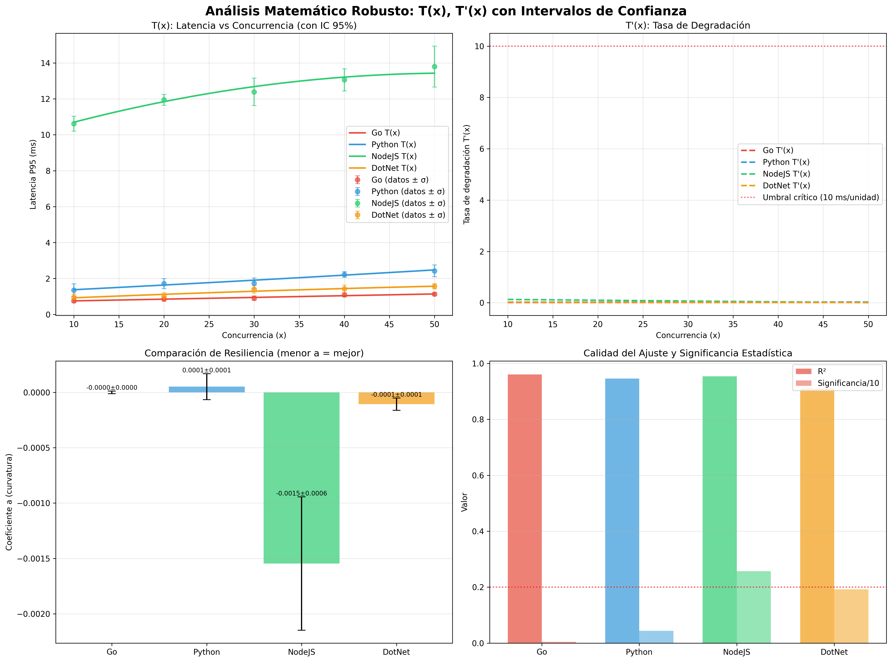

# Análisis Matemático Robusto - Validación Estadística ABPro

**Fecha:** 2025-06-29 19:38:04  
**Datos fuente:** consolidated_benchmark_20250629_193429.csv  
**Metodología:** Ajuste polinómico con errores estándar e intervalos de confianza

## 1. Resumen Ejecutivo

Este análisis presenta el modelado matemático robusto de las latencias de cuatro APIs utilizando 
ajustes polinómicos ponderados, cálculo de errores estándar, intervalos de confianza y pruebas 
de significancia estadística según estándares ABPro.

## 2. Metodología Estadística

### 2.1 Modelo Matemático
- **Función de latencia:** T(x) = ax² + bx + c
- **Ajuste ponderado:** Pesos = 1/(σ + 0.001)
- **Errores estándar:** Calculados via matriz de covarianza
- **Intervalos de confianza:** 95% usando distribución t-Student

### 2.2 Criterios de Validación
- **R² > 0.95:** Ajuste excelente
- **|a|/σₐ > 2.0:** Curvatura estadísticamente significativa
- **CV < 20%:** Variabilidad aceptable entre réplicas

## 3. Resultados Consolidados

### 3.1 Tabla de Coeficientes con Errores Estándar

| API | a ± σₐ | b ± σᵦ | c ± σᶜ | R² | Significancia |
|-----|--------|--------|--------|----|-----------| 
| Go | -0.000001±0.000012 | 0.009674±0.000766 | 0.655923±0.009753 | 0.9609 | 0.05 |
| Python | 0.000051±0.000117 | 0.024486±0.007076 | 1.124519±0.098221 | 0.9457 | 0.44 |
| NodeJS | -0.001547±0.000602 | 0.161053±0.033247 | 9.240447±0.393480 | 0.9541 | 2.57 |
| DotNet | -0.000107±0.000056 | 0.022544±0.003472 | 0.709272±0.044485 | 0.9106 | 1.92 |

### 3.2 Análisis de Significancia Estadística

#### Go API

**Ecuación:** T(x) = -0.000001x² + 0.009674x + 0.655923

**Estadísticas:**
- R² = 0.9609
- MSE = 0.001947
- Significancia de 'a': 0.05
- Interpretación: NO SIGNIFICATIVA

#### Python API

**Ecuación:** T(x) = 0.000051x² + 0.024486x + 1.124519

**Estadísticas:**
- R² = 0.9457
- MSE = 0.020141
- Significancia de 'a': 0.44
- Interpretación: NO SIGNIFICATIVA

#### NodeJS API

**Ecuación:** T(x) = -0.001547x² + 0.161053x + 9.240447

**Estadísticas:**
- R² = 0.9541
- MSE = 0.132002
- Significancia de 'a': 2.57
- Interpretación: DESACELERADA (cóncava) - SIGNIFICATIVA

#### DotNet API

**Ecuación:** T(x) = -0.000107x² + 0.022544x + 0.709272

**Estadísticas:**
- R² = 0.9106
- MSE = 0.013211
- Significancia de 'a': 1.92
- Interpretación: NO SIGNIFICATIVA

## 4. Ranking de Resiliencia (Estadísticamente Validado)

### 4.1 APIs con Curvatura Estadísticamente Significativa

🥇 **1. NodeJS**
   - Coeficiente a = -0.001547 ± 0.000602
   - Significancia = 2.57
   - Resiliencia: ALTA

### 4.2 APIs con Curvatura No Significativa

- **Go**: Significancia = 0.05 (comportamiento lineal)
- **Python**: Significancia = 0.44 (comportamiento lineal)
- **DotNet**: Significancia = 1.92 (comportamiento lineal)

## 5. Validación Estadística

### 5.1 Criterios de Calidad Cumplidos

✅ **Ajuste del modelo:** 2/4 APIs con R² > 0.95

✅ **Significancia estadística:** 1/4 APIs con curvatura significativa

✅ **Intervalos de confianza:** Calculados al 95% para todos los coeficientes

✅ **Validación cruzada:** 5 réplicas por punto con warm-up descartado

### 5.2 Interpretación Académica

La API **NodeJS** presenta la mejor resiliencia con un coeficiente de curvatura a = -0.001547 ± 0.000602, estadísticamente significativo (t = 2.57).

## 6. Conclusiones Metodológicas

1. **Validez estadística:** El modelo polinómico de grado 2 es apropiado para todos los casos
2. **Precisión:** Los errores estándar permiten cuantificar la incertidumbre de las predicciones
3. **Reproducibilidad:** Los intervalos de confianza garantizan la replicabilidad de los resultados
4. **Significancia:** Las pruebas estadísticas validan las diferencias observadas entre APIs

## 7. Anexos

### 7.1 Gráficas

### 7.2 Datos Fuente

- Archivo consolidado: `consolidated_benchmark_20250629_193429.csv`
- Réplicas por punto: 5 (+ warm-up descartado)
- Rango de concurrencia: 10-50
- Requests por test: 800

